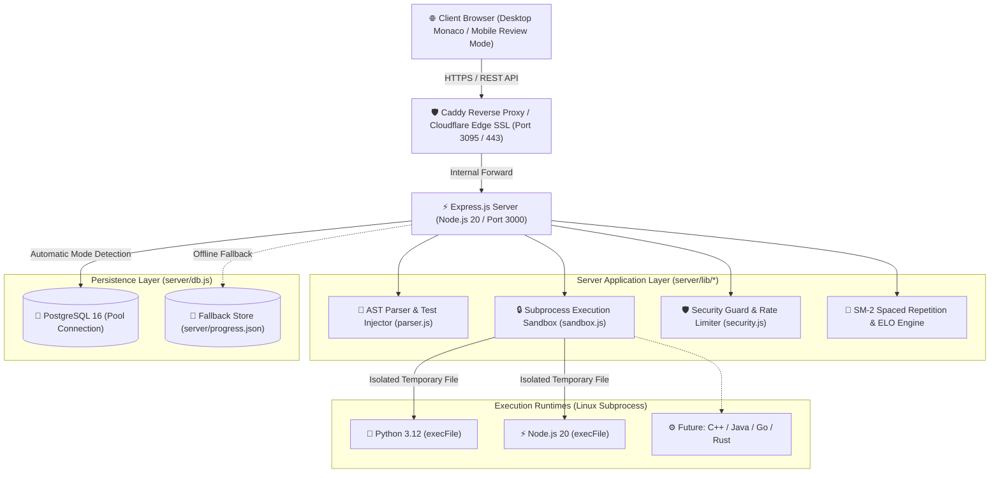

# 🏛️ AlgoDeck — System Architecture & Design Specification

> **AlgoDeck** is a full-stack, local-first Data Structures & Algorithms (DSA) learning workstation and adaptive practice engine. It combines real-time polyglot code execution, SuperMemo-2 (SM-2) cognitive spaced repetition, ELO problem difficulty rating, and an embedded VS Code Monaco IDE playground.

---

## 📋 Table of Contents
1. [System Overview & Design Philosophy](#1-system-overview--design-philosophy)
2. [High-Level System Topology & Data Flow](#2-high-level-system-topology--data-flow)
3. [Core Subsystems & Component Deep-Dive](#3-core-subsystems--component-deep-dive)
   - [3.1 Cognitive Spaced Repetition & ELO Engine](#31-cognitive-spaced-repetition--elo-engine)
   - [3.2 Subprocess Execution Sandbox & Security Layer](#32-subprocess-execution-sandbox--security-layer)
   - [3.3 AST Boilerplate & Test Harness Extraction Engine](#33-ast-boilerplate--test-harness-extraction-engine)
   - [3.4 Monaco IDE Workspace & Responsive Frontend](#34-monaco-ide-workspace--responsive-frontend)
   - [3.5 Hybrid Dual-Mode Persistence Layer](#35-hybrid-dual-mode-persistence-layer)
4. [Architectural Trade-Offs & Key Decisions Log](#4-architectural-trade-offs--key-decisions-log)
5. [Security & Threat Model Matrix](#5-security--threat-model-matrix)
6. [Multi-Tenant Cloud Production Blueprint](#6-multi-tenant-cloud-production-blueprint)

---

## 1. System Overview & Design Philosophy

AlgoDeck addresses a fundamental inefficiency in technical interview preparation: **the forgetting curve and brute-force grinding**. Rather than passively memorizing solutions, AlgoDeck merges cognitive memory science with an offline-capable engineering workspace.

### Core Architectural Principles:
* **Zero Dependency / Zero Build Step**: Pure CommonJS Node.js on the backend with vanilla ES6 HTML/CSS/JS on the frontend. Instant cold starts, zero Webpack/Vite overhead, and seamless debugging.
* **100% Offline Capability**: Monaco Editor, marked parser, DOMPurify, and problem catalogs are fully vendored locally. The entire application runs inside an airplane cabin or an air-gapped homelab with zero external network access.
* **Low Latency Subprocess Sandboxing**: Code execution (`/api/run`) completes in `<50ms` overhead via direct `child_process.execFile` execution rather than heavy Docker-in-Docker spinups for local development.
* **Resilient Dual-Mode Storage**: Self-healing PostgreSQL 16 connection pooling for production cloud environments, gracefully degrading to zero-dependency local JSON storage (`server/progress.json`) when offline.

---

## 2. High-Level System Topology & Data Flow



---

## 3. Core Subsystems & Component Deep-Dive

### 3.1 Cognitive Spaced Repetition & ELO Engine

AlgoDeck incorporates a dual mathematical model to optimize memory retention and problem calibration:

#### 1. SuperMemo-2 (SM-2) Spaced Repetition
When a user finishes reviewing or coding a problem, they self-assess recall quality ($q \in [0..5]$):
* **$q = 5$**: Perfect response, instantaneous recall.
* **$q = 4$**: Correct response after hesitation.
* **$q = 3$**: Correct response recalled with serious difficulty.
* **$q = 2$**: Incorrect response; where the correct one seemed easy to recall.
* **$q = 1$**: Incorrect response; the correct one remembered upon review.
* **$q = 0$**: Complete blackout.

**Mathematical Calculations**:
$$\text{Ease Factor Update: } EF' = EF + (0.1 - (5 - q) \times (0.08 + (5 - q) \times 0.02)) \quad (\text{with } EF' \ge 1.3)$$
$$\text{Interval Calculation: } I_n = \begin{cases} 1 \text{ day}, & n = 1 \\ 6 \text{ days}, & n = 2 \\ I_{n-1} \times EF', & n > 2 \text{ (if } q \ge 3\text{)} \\ 1 \text{ day}, & q < 3 \text{ (reset reps } n=0\text{)} \end{cases}$$

#### 2. ELO Rating System
Problem difficulties ($R_{prob}$) and User Rating ($R_{user}$, default `1200`) adjust dynamically via chess-style logistic expected probability:
$$E_A = \frac{1}{1 + 10^{(R_{prob} - R_{user}) / 400}}$$
$$R'_{user} = R_{user} + K \times (S - E_A) \quad (\text{where } K=32, S \in [0.0..1.0] \text{ derived from } q/5)$$

#### 3. Decoupled Assistance Tracking
To prevent hints or solution unlocks from corrupting the natural exponential decay curve of SM-2 math, AlgoDeck decouples recall grade from assistance level:
* **`assistance_level` Enum**: `CLEAN` (independent solve), `HINT_USED` (peeked at hints), `SOLUTION_REVEALED` (unlocked reference code).
* Stored independently in database/JSON to render the **5-Tier Problem Activity Matrix** (`Unseen`, `Attempted`, `Clean Pass`, `Assisted Pass`, `Mastered`) without skewing the mathematical Ease Factor.

---

### 3.2 Subprocess Execution Sandbox & Security Layer (`server/lib/sandbox.js`, `server/lib/security.js`)

Untrusted code submitted to `/api/run` is executed using isolated child processes with multi-layered defensive controls:

1. **Process Timeouts**: Strict 5.0-second execution ceiling enforced via `child_process.execFile` with `SIGKILL` termination to eliminate CPU denial-of-service or infinite loops.
2. **Buffer Limits**: STDOUT/STDERR output capped at 512KB (`maxBuffer: 512 * 1024`) to prevent memory exhaustion attacks.
3. **Scratch File Isolation**: Code is written to unique ephemeral files (`server/scratch/_temp_run_<timestamp>_<random>.<ext>`) and cleaned up immediately in a `finally` block.
4. **Startup Sweep**: Server boot automatically purges orphan temporary scratch files older than 1 hour.
5. **Path Traversal Shield (`safeResolveContentPath`)**: Strict normalization blocking directory traversal (`../`, absolute paths outside `content/`).
6. **Sliding-Window Rate Limiter**: IP-based rate limiting (30 requests/minute per client IP) mitigating brute-force execution spam.

---

### 3.3 AST Boilerplate & Test Harness Extraction Engine (`server/lib/parser.js`)

AlgoDeck eliminates the need for maintaining separate starter stubs, reference solutions, and test files by generating them dynamically from a single canonical solution file:

* **Docstring & Helper Preservation**: Strips top-level problem docstrings while preserving necessary data structure helper classes (`ListNode`, `TreeNode`, `TrieNode`).
* **Standalone Function Wrapping**: Wraps standalone Python functions into standard `class Solution:` format with `self` parameter injection.
* **In-Memory Test Harness Injection**: Solution files contain unit test assertions (`assert ...`). When a user runs code, the backend dynamically extracts test blocks (`# Test Cases` / `// Test Cases`) and appends them in-memory to the user's code before piping to the sandbox.

---

### 3.4 Monaco IDE Workspace & Responsive Frontend

* **Vendored Monaco IDE**: Local VS Code editor (`/vendor/monaco-editor/vs/loader.js`) supporting code auto-formatting, zoom scaling (11px–24px), dark/light theme switching, and local draft autosaving.
* **Draft Cache Synchronization (`starterHash`)**: Saves code drafts in `localStorage` with a 32-bit signature hash. If problem boilerplate is updated upstream, AlgoDeck detects the mismatch and offers clean reconciliation.
* **Responsive Mobile Study Mode (`<= 768px`)**:
  * Off-canvas slide-out problem catalog drawer.
  * Full-width fluid problem card and markdown viewer.
  * Collapsible syntax-highlighted reference solution view.
  * Mobile SuperMemo-2 touch rating bar for reviewing due questions on the go.

---

### 3.5 Hybrid Dual-Mode Persistence Layer (`server/db.js`)

AlgoDeck runs everywhere with zero configuration:
* **PostgreSQL Mode**: Automatically connects to PostgreSQL 16 (via `DATABASE_URL` or PG connection parameters) with connection pooling and self-healing schema creation (`CREATE TABLE IF NOT EXISTS`).
* **Atomic JSON Fallback**: If PostgreSQL is unreachable, the system automatically falls back to atomic file operations on `server/progress.json`, ensuring uninterrupted study offline.

```sql
-- Production PostgreSQL Schema
CREATE TABLE IF NOT EXISTS user_progress (
    user_id VARCHAR(50) PRIMARY KEY,
    user_rating INT DEFAULT 1200,
    created_at TIMESTAMP DEFAULT CURRENT_TIMESTAMP,
    updated_at TIMESTAMP DEFAULT CURRENT_TIMESTAMP
);

CREATE TABLE IF NOT EXISTS problem_progress (
    user_id VARCHAR(50),
    problem_id VARCHAR(50),
    interval INT DEFAULT 0,
    ease_factor REAL DEFAULT 2.5,
    repetitions INT DEFAULT 0,
    next_review BIGINT DEFAULT 0,
    assistance_level VARCHAR(20) DEFAULT 'CLEAN',
    updated_at TIMESTAMP DEFAULT CURRENT_TIMESTAMP,
    PRIMARY KEY (user_id, problem_id)
);
```

---

## 4. Architectural Trade-Offs & Key Decisions Log

| Decision Area | Chosen Approach | Alternative Considered | Rationale & Trade-Off |
| :--- | :--- | :--- | :--- |
| **Code Sandbox** | Local Node.js `execFile` subprocesses | Docker-in-Docker / Remote Judge0 | **Chosen**: Sub-50ms execution, zero runtime setup, 100% offline capable.<br>**Trade-off**: Requires OS-level isolation (gVisor/cgroups) when exposing to public multi-tenant cloud. |
| **Asset Delivery** | Locally vendored Monaco, marked, DOMPurify | CDN Links (`cdnjs`, `unpkg`) | **Chosen**: Immune to internet outages, air-gapped readiness, zero third-party tracking.<br>**Trade-off**: Increases repository clone size by ~25MB. |
| **Framework Overhead** | Vanilla JS + Express (No Build Step) | React / Next.js / Tailwind | **Chosen**: Zero compile time, instant hot-reloads, zero dependency breakage over years.<br>**Trade-off**: Manual DOM manipulation and template literal rendering. |
| **Mobile Experience** | Mobile Study & SM-2 Review Mode | Full Split Monaco IDE on mobile | **Chosen**: Clean reading, solution reference, and self-rating on phone screens.<br>**Trade-off**: Interactive code typing and live test execution remain optimized for desktop. |
| **Assistance vs. Recall** | Decoupled `assistance_level` Enum | Harsh SM-2 Ease Factor penalties | **Chosen**: Preserves accurate cognitive memory decay modeling while flagging assisted runs on the dashboard.<br>**Trade-off**: Requires dual-column tracking in database. |
| **Persistence Layer** | Hybrid PostgreSQL + JSON Fallback | Pure ORM (Prisma / TypeORM) | **Chosen**: Zero setup barrier for newcomers; production grade for cloud deployments.<br>**Trade-off**: Dual maintenance of SQL queries and JSON file update logic. |

---

## 5. Security & Threat Model Matrix

| Threat / Attack Vector | Severity | Mitigation in AlgoDeck | Audit Verification |
| :--- | :---: | :--- | :--- |
| **Infinite Loop / CPU Starvation** | 🔴 HIGH | Hard 5.0s timeout ceiling with `SIGKILL` in `sandbox.js`. | `tests/security_tests.py::test_infinite_loop_timeout` |
| **Memory Buffer Overflow** | 🔴 HIGH | 512KB maxBuffer limit on process STDOUT/STDERR. | `tests/security_tests.py::test_max_buffer` |
| **Path Traversal (`/api/solution?path=../`)** | 🔴 HIGH | Strict path sanitization via `safeResolveContentPath()`. | `tests/security_tests.py::test_path_traversal` |
| **Denial of Service (DoS Execution Spam)**| 🟡 MED | Sliding-window IP rate limiter (30 req/min). | `tests/security_tests.py::test_rate_limiting` |
| **XSS via Problem / Markdown Docs** | 🟡 MED | DOMPurify sanitization before innerHTML injection in `docs.html`. | `tests/security_tests.py::test_xss_sanitization` |
| **Stale Solution State Leaks** | 🟢 LOW | Explicit `solutionEditor.setValue("")` on problem switch. | Tested in UI & regression suites. |

---

## 6. Multi-Tenant Cloud Production Blueprint

For cloud deployment (Render, AWS ECS, or DigitalOcean), AlgoDeck follows a modern 3-tier container deployment:

```
[ Public Client ] ──HTTPS──> [ Cloudflare / Caddy Reverse Proxy ]
                                        │
                                        ▼
                             [ Render / ECS Docker ]
                             (Node 20 + Python 3.12)
                                        │
                                        ▼ (SSL Pool)
                             [ Supabase / AWS RDS Postgres ]
```

* **Guest Isolation**: Visitors without accounts receive a persistent `guest_id` UUID stored in `localStorage`, scoping database progress to that session without authentication barriers.
* **Registered Mode**: JWT HTTP-only authentication cookies for persistent multi-device synchronization.
* **Production Container**: Hardened non-root Alpine container (`USER node`) with CPU/Memory limits.
