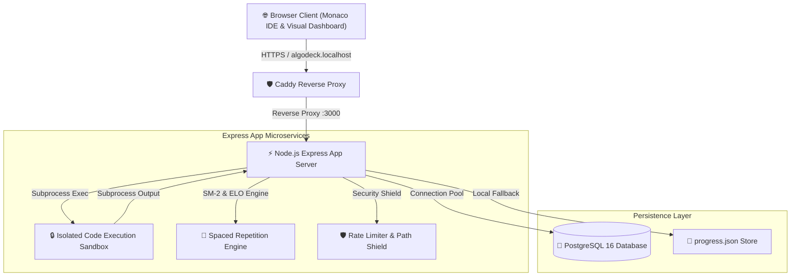

# 🌌 AlgoDeck — Visual DSA Practice & Spaced-Repetition Workstation

<p align="center">
  
  
  
  
  
</p>

> **AlgoDeck** is a full-stack Data Structures & Algorithms (DSA) learning workstation and adaptive practice engine. It combines real-time polyglot code execution (Python 3 & JavaScript), SuperMemo-2 (SM-2) spaced-repetition scheduling, ELO problem difficulty ratings, and a VS Code Monaco IDE workspace.

---

## 🌟 Key Features

* **🧠 Cognitive Spaced Repetition (SuperMemo-2 Engine)**: Dynamically calculates optimal review intervals ($I_n$) and Ease Factors ($EF$) based on your performance scores ($q \in [0..5]$) so you never forget core algorithm patterns.
* **♟️ ELO Rating System**: Adjusts your user rating ($R_{user}$) and problem difficulties ($R_{prob}$) in real-time using expected probability calculations after every practice session.
* **💻 Monaco IDE Workspace**: Dual-pane Monaco editor with custom syntax highlighting, indentation guides, code auto-formatting, font zoom ($10px \leftrightarrow 28px$), word-wrap toggles, and starter code reset.
* **🔒 Isolated Subprocess Code Execution Sandbox**: Executes Python 3 and JavaScript code safely in real-time with 5-second process kill timeouts and 512KB output buffer caps.
* **📊 Visual Curriculum Roadmap**: Interactive 19-topic pattern visualizer mapping **75 curated DSA problems** (Blind 75 & NeetCode 150 aligned).
* **🗄️ Dual-Mode Persistence**: Seamlessly switches between PostgreSQL 16 database connection pooling and zero-dependency local JSON storage (`progress.json`).
* **🧪 100% Automated Test Suite**: Integrated test harness (`npm test`) validating 150 problem solutions, security path-traversal shields, and content integrity.

---

## 🌐 Dual Distribution Modes

AlgoDeck supports two execution models out of the box:

1. **☁️ Online Cloud SaaS (`https://algodeck.dev`)**: Zero-install instant browser workspace with guest UUID isolation and multi-user JWT authentication.
2. **💻 Local On-Device Workstation (`docker compose up`)**: 100% offline-capable development environment running locally on your laptop without any cloud API dependencies.

---

## 🏗️ System Architecture



---

## 🚀 Quick Start

### Mode 1: Using Docker Compose (Recommended)

```bash
# 1. Clone Repository
git clone https://github.com/anmolsharma152/AlgoDeck.git
cd AlgoDeck

# 2. Launch Stack (App + PostgreSQL)
docker compose up -d --build

# 3. Open in Browser
# Access https://algodeck.localhost or http://localhost:3095
```

### Mode 2: Local Node.js & Python

```bash
# 1. Install Dependencies
npm install

# 2. Run Test Harness
npm test

# 3. Start Server
npm start
```

---

## 📂 Project Directory Structure

```text
AlgoDeck/
├── public/                 # Frontend Web Pages & Assets
│   ├── index.html          # Dashboard & Review Visualizer
│   ├── editor.html         # Monaco Practice Playground
│   ├── roadmap.html        # Interactive 19-Pattern Curriculum Map
│   ├── css/global.css      # Design System Stylesheet
│   ├── js/global.js        # Shared UX & Navigation Modules
│   └── tracker.json        # Static Problem Catalog Metadata
│
├── server/                 # Express API Backend & Engines
│   ├── server.js           # REST API Server & Subprocess Sandbox
│   ├── db.js               # PostgreSQL Pool & Auto-Migrations
│   ├── descriptions.json   # HTML LeetCode Problem Statements
│   └── progress.json       # Fallback Progress Store
│
├── content/                # 19 DSA Pattern Solution Repositories
│   ├── 01-arrays-and-hashing/
│   ├── 02-two-pointers/
│   ├── ... (03 through 19)
│   └── test_runner.py      # Batch Solution Assertion Harness
│
├── tests/                  # Automated Test Suites
│   ├── content_tests.py    # Problem Structure & Boilerplate Audit
│   ├── security_tests.py   # Path Traversal & Rate Limiter Tests
│   └── run_all_tests.py    # Master Test Runner (npm test)
│
├── docker-compose.yml      # Multi-Container Compose Manifest
├── Dockerfile              # Node 20 + Python 3 Container Build
└── architecture.md         # Comprehensive System Architecture Guide
```

---

## 📚 Technical Documentation

- 🏛️ **[System Architecture Guide (`docs/architecture.md`)](file:///home/anmol/Projects/AlgoDeck/docs/architecture.md)** — Deep dive into SM-2 math equations, ELO rating logistic functions, Monaco AST parsing, and security layers.
- 🚀 **[Cloud Deployment Blueprint (`docs/deployment_plan.md`)](file:///home/anmol/Projects/AlgoDeck/docs/deployment_plan.md)** — Step-by-step production hosting guide for Render, AWS EC2/ECS, Supabase PostgreSQL, and Caddy reverse proxies.
- 🌐 **[Distribution & SaaS Strategy (`docs/distribution_plan.md`)](file:///home/anmol/Projects/AlgoDeck/docs/distribution_plan.md)** — Strategy for online SaaS vs local offline desktop workstation, and feature roadmap for LeetCode/NeetCode parity.
- 🏗️ **[System Design Implementation Plan (`docs/implementation_plan.md`)](file:///home/anmol/Projects/AlgoDeck/docs/implementation_plan.md)** — Actionable roadmap for multi-tenant auth, gVisor sandboxing, and CI/CD pipelines.

---

## 🧪 Running Automated Tests

AlgoDeck includes a 3-tier automated test harness:

```bash
npm test
```

* **Content Audit**: Verifies all 75 problems have complete HTML descriptions, solution files, and starter code extractors.
* **Security Penetration Tests**: Verifies path-traversal shielding (`../`), 5-second process execution timeouts, and rate-limiting limits.
* **Solution Runner**: Executes all 150 Python & JavaScript solutions against test assertion inputs.

---

## 📄 License

Distributed under the **MIT License**. See `LICENSE` for details.
