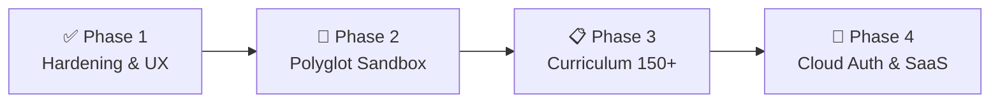
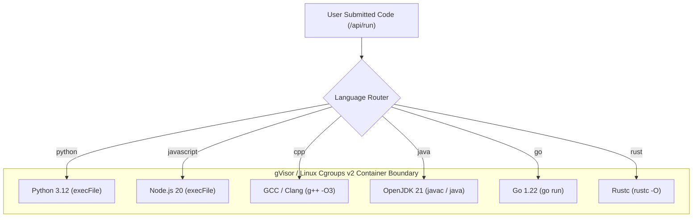
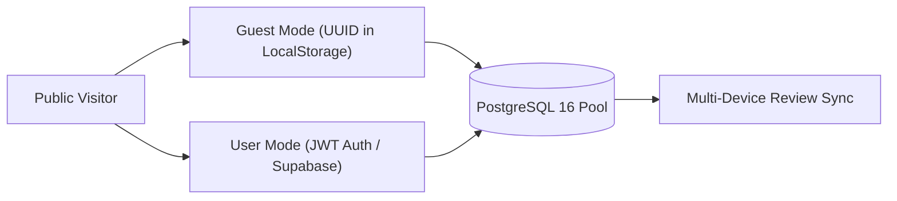

# 📋 AlgoDeck — Master Task Matrix & Engineering Roadmap

This document serves as the **operational task tracker** and **engineering execution plan** for AlgoDeck. It records completed milestones, active workstreams, and scheduled future phases.

---

## 🧭 Master Phase Progression

| Phase | Focus Area | Status | Target Timeline |
| :--- | :--- | :---: | :--- |
| **Phase 1** | **Hardening, Nudges, Mobile Responsive & Refactor** | ✅ **COMPLETED** | Complete (Verified 100% Pass) |
| **Phase 2** | **Polyglot Execution & Sandbox Hardening** | 🔄 **ACTIVE / NEXT UP** | Q3 2026 |
| **Phase 3** | **Curriculum Expansion (75 → 150+ Questions)** | 📋 **PLANNED** | Q4 2026 |
| **Phase 4** | **Multi-Tenant Cloud, JWT Auth & Distribution** | 🚀 **PLANNED** | Q1 2027 |

---

## ✅ Phase 1: Hardening, UX, Behavioral Nudges & Refactor (COMPLETED)

All foundational hardening, user experience enhancements, and modular backend refactors have been completed, verified via automated test suites, and deployed.

| Task ID | Component | Feature / Refactor | Implementation Summary | Status |
| :---: | :--- | :--- | :--- | :---: |
| **T-101** | UX / Navigation | **Explicit "Due Filter" Toggle** | Added dedicated `[ 🔔 Due Only ]` toggle buttons in both `playground.html` and `dashboard.html`. | ✅ DONE |
| **T-102** | Brand Identity | **Standardized `<title>` Tags** | Standardized all page titles to `AlgoDeck \| <Page Name>` across all HTML files. | ✅ DONE |
| **T-103** | Server Routing | **Clean Route Aliases** | Added `/playground`, `/editor`, `/dashboard`, `/roadmap`, `/docs` aliases in `server/server.js`. | ✅ DONE |
| **T-104** | Editor Async | **Fetch Race-Condition Guard** | Integrated `AbortController` in `playground.html` to cancel stale in-flight boilerplate requests. | ✅ DONE |
| **T-105** | Editor State | **Stale Solution Cache Flush** | Added `solutionEditor.setValue("")` upon problem switch to prevent stale solution leaks. | ✅ DONE |
| **T-106** | Cognitive Nudges| **Header Status Pill & Daily Deck** | Navbar `🔔 X Due Today` pill with 24h snooze + `/playground.html?mode=daily_deck` auto-queue. | ✅ DONE |
| **T-107** | Dashboard | **5-Tier Activity Matrix** | Implemented `assistance_level` enum (`CLEAN`, `HINT_USED`, `SOLUTION_REVEALED`) + 5-tier matrix. | ✅ DONE |
| **T-108** | Sandbox | **Scratch Orphan Cleanup Sweep** | Added automatic startup sweep purging temp files (`_temp_run_*`) older than 1 hour. | ✅ DONE |
| **T-109** | Draft Cache | **`starterHash` Cache Versioning** | Implemented 32-bit boilerplate signature hashing to synchronize local drafts with upstream edits. | ✅ DONE |
| **T-110** | Architecture | **Modular `server/lib/*` Split** | Decomposed monolithic `server.js` into `parser.js`, `sandbox.js`, and `security.js`. | ✅ DONE |
| **T-111** | UI / Layout | **Collapsed Sidebar Mini-Rail** | Uniform 10px spacing for 19 pattern icons in 50px collapsed activity rail mode. | ✅ DONE |
| **T-112** | UI / Layout | **Dashboard Space Optimization** | High-density unified hero metrics bar (Progress + ELO + 4-tier activity strip) and swipeable chips. | ✅ DONE |
| **T-113** | Mobile Platform | **Platform-Wide Mobile Overhaul** | Mobile drawer navigation, full-width bio, swipeable docs chips, and mobile SM-2 study mode. | ✅ DONE |
| **T-114** | Terminal UI | **Console Text Alignment Fix** | Removed HTML source indentation whitespace in `terminal-body` for flush left alignment. | ✅ DONE |
| **T-115** | UI / Responsive | **Tablet & Half-Screen (≤ 1024px) Layouts** | Compact navbar (`flex-wrap: nowrap`, 6px 11px padding), adjusted mobile menu trigger to 820px, scaled hero title (2.35rem), and balanced 2x2 stats/metrics grids on Home and Dashboard. | ✅ DONE |

---

## 🔄 Phase 2: Polyglot Execution & Sandbox Hardening (ACTIVE / NEXT UP)

Expand AlgoDeck from dual-language (Python/JS) to a multi-language competitive programming and interview workstation with OS-level execution controls.

### Phase 2 Task Matrix:

| Task ID | Priority | Module | Task Description | Technical Requirements |
| :---: | :---: | :--- | :--- | :--- |
| **T-201** | 🔴 P0 | `sandbox.js` | **C++ Execution Runner (`g++ -O3`)** | Implement compile-and-execute pipeline for C++17/20. Write temporary `.cpp` file, compile with `g++ -O3`, execute binary, capture output, and delete binary in `finally`. |
| **T-202** | 🔴 P0 | `sandbox.js` | **Java Execution Runner (`javac`/`java`)** | Implement Java class compiler and runner. Auto-wrap code into `class Solution` and test harness inside a `Main` runner. |
| **T-203** | 🟡 P1 | `sandbox.js` | **Go (`go run`) & Rust (`rustc`) Runners** | Add lightweight compilation pipelines for Go and Rust solutions. |
| **T-204** | 🔴 P0 | `parser.js` | **Polyglot Boilerplate & Test Extractors** | Expand `server/lib/parser.js` with `extractCppBoilerplate()`, `extractJavaBoilerplate()`, and test harness extractors. |
| **T-205** | 🟡 P1 | `playground.html` | **Multi-Language Selector Tabs** | Update language selection toolbar (`[Python] [JavaScript] [C++] [Java] [Go]`) and synchronize editor language modes in Monaco. |
| **T-206** | 🔴 P0 | `security.js` | **Linux Cgroups v2 / gVisor Isolation** | In cloud/production environments, constrain execution subprocesses with memory ceiling (`128MB`), CPU quota (`0.5 cores`), and network isolation (`--network none`). |

---

## 📋 Phase 3: Curriculum & Question Bank Expansion (PLANNED)

Scale the curriculum from the foundational 75 problems to 150+ high-yield interview problems across all 19 algorithmic patterns.

| Task ID | Target Pattern | Planned Problems to Add | Deliverables |
| :---: | :--- | :--- | :--- |
| **T-301** | **Arrays & Hashing (10 $\rightarrow$ 18)** | Top K Frequent, Product of Array Except Self, Longest Consecutive Sequence, Encode and Decode Strings. | `content/01-*` (Py/JS/C++ solutions + test cases + `descriptions.json`). |
| **T-302** | **Two Pointers & Sliding Window** | 3Sum Closest, Minimum Window Substring, Sliding Window Maximum, Longest Repeating Character Replacement. | `content/02-*`, `content/03-*` solutions + tests. |
| **T-303** | **Trees & Binary Search** | Kth Smallest Element in BST, Serialize/Deserialize Binary Tree, Median of Two Sorted Arrays, Time Based Key-Value Store. | `content/05-*`, `content/07-*` solutions + tests. |
| **T-304** | **Dynamic Programming (1D & 2D)** | Decode Ways, Coin Change II, Target Sum, Longest Increasing Subsequence, Burst Balloons. | `content/13-*`, `content/14-*` solutions + tests. |
| **T-305** | **Advanced Graphs & CP Patterns** | Alien Dictionary, Cheapeast Flights Within K Stops, Segment Trees, Fenwick Trees (BIT). | `content/12-*`, `content/19-*` solutions + tests. |
| **T-306** | **Catalog Integrity Audit** | Automated audit ensuring 1:1 synchronization between `tracker.json`, `descriptions.json`, and `content/`. | Verified by `npm test`. |

---

## 🚀 Phase 4: Multi-Tenant Cloud Architecture, Auth & Distribution (UPCOMING)

Transform AlgoDeck from a local workstation into a public SaaS and portfolio showcase.

| Task ID | Module | Feature Description | Deliverables |
| :---: | :--- | :--- | :--- |
| **T-401** | Auth Engine | **Dual-Mode Authentication (Guest UUID + JWT)** | Allow zero-friction guest sessions while supporting registered user login via HTTP-only JWT cookies. |
| **T-402** | CI/CD | **GitHub Actions Pipeline (`.github/workflows/deploy.yml`)** | Automated lint, security audit, and 150+ solution evaluation on every push to `master`. |
| **T-403** | Cloud Hosting | **Render / AWS ECS Deployment** | Deploy Docker container with Supabase PostgreSQL connection pool. |
| **T-404** | Custom Domain | **Caddy / Cloudflare SSL Setup** | Connect custom domain (e.g., `algodeck.dev`) with automated Let's Encrypt certificates. |
| **T-405** | Analytics | **Global Activity Heatmap & Leaderboard** | Visual GitHub-style commit/solve contribution grid and pattern mastery scorecards. |

---

## 🛡️ Task Execution & Contribution Contract

When picking up any task from this matrix:
1. **Preserve Security Audit Contract**: Never remove or rename static string literals checked by `tests/security_tests.py` (`problem_id: problem.id`, `ALLOWED_DOCS`, `DOMPurify`, etc.).
2. **Atomic Verification**: Always run `npm test` to ensure **100% test pass rate** across all solution evaluations and security audits before committing.
3. **Conventional Commits**: Use conventional prefixes: `feat(<module>):`, `fix(<module>):`, `docs(<module>):`, `refactor(<module>):`.
4. **Docker Synchronization**: Rebuild and test Docker container (`docker compose up -d --build app`) after making changes to core server or frontend code.
