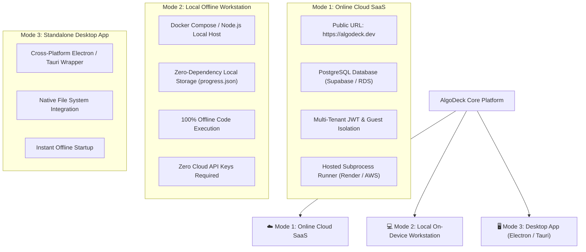

# 🌐 AlgoDeck — Dual Distribution & Production Platform Strategy

This document outlines the **Distribution & Feature Roadmap Strategy** for **AlgoDeck** to operate both as an **Online Cloud Platform (SaaS)** and a **Local On-Device Offline Engineering Workstation**, reaching full feature parity with platforms like LeetCode and NeetCode.

---

## 🎯 1. Dual Distribution Strategy

AlgoDeck is engineered with a hybrid architecture supporting two distinct deployment models:



---

### Mode 1: Online Cloud SaaS Platform (`https://algodeck.dev`)
* **Target Audience**: Recruiter portfolio reviews, technical interviewers, online students, mobile/tablet users.
* **Hosting Stack**: Dockerized Node.js 20 App on Render / AWS EC2, Supabase PostgreSQL, Caddy Reverse Proxy with SSL.
* **Key Features**:
  - Zero-installation instant browser access.
  - Multi-tenant Guest UUIDs (`x-guest-id`) and JWT User Accounts.
  - Public leaderboard, ELO rating updates, and global problem metrics.

### Mode 2: Local On-Device Workstation (`docker compose up`)
* **Target Audience**: Engineers preparing for interviews offline, developers on flights/travel, privacy-focused users.
* **Setup**:
  ```bash
  git clone https://github.com/YOUR_USERNAME/AlgoDeck.git
  cd AlgoDeck
  docker compose up -d
  ```
* **Key Features**:
  - Works 100% offline without active internet.
  - Uses PostgreSQL or local JSON file fallback (`server/progress.json`).
  - Unlimited code execution without cloud rate-limits.

### Mode 3: Desktop Application (Future Expansion)
* **Target Audience**: Native desktop application users (macOS, Linux, Windows).
* **Stack**: Tauri (Rust + Webview2) or Electron wrapper packaging Monaco IDE + Node.js backend.

---

## 🏆 2. Feature Parity Gap Analysis (LeetCode & NeetCode)

To achieve 100% feature parity with commercial platforms like LeetCode and NeetCode:

| Feature Area | Current AlgoDeck Implementation | LeetCode / NeetCode Parity Goal | Priority |
| :--- | :--- | :--- | :--- |
| **Code Execution Engine** | Python 3.12 & Node 20 Subprocesses | Add C++ (GCC 13), Java 21, Go 1.22, Rust | 🟢 High |
| **Spaced Repetition** | SuperMemo-2 (SM-2) Interval Engine | Automatic Calendar Sync & Email Reminders | 🟡 Medium |
| **Problem Catalog** | 75 Curated DSA Problems across 19 Patterns | Expand to 150 (NeetCode 150) & 300+ Problems | 🟢 High |
| **Visualizer & AST** | Visual Curriculum Roadmap & Graph Layout | Interactive Array/Tree Execution Step-Visualizer | 🟡 Medium |
| **User Progress & Auth** | PostgreSQL & JSON Dual-Mode Persistence | OAuth2 (Google, GitHub) + JWT Sessions | 🟢 High |
| **Submissions & Analytics** | Terminal Execution Output | Time & Space Complexity Distribution Graphs ("Beats 95%") | 🟡 Medium |
| **Community & Discussions** | Local Solution Reference Tab | User Solution Submissions & Markdown Comments | ⚪ Low |

---

## 🚀 3. Implementation Roadmap to Full Production SaaS

### Phase 1: Authentication & Multi-Tenancy (Current Target)
- Implement `POST /api/auth/register` and `POST /api/auth/login`.
- Add `x-guest-id` fallback for non-registered visitors.

### Phase 2: Expanded Language Execution Sandbox
- Extend `/api/run` to support C++ (`g++ -O2 solution.cpp`) and Java (`javac Solution.java && java Solution`).
- Add memory limit enforcement per language (e.g., 256MB per process).

### Phase 3: Analytics & Benchmark Visualizer
- Add execution timing benchmarking in `/api/run` using `process.hrtime.bigint()`.
- Render time-complexity comparison histograms in `public/editor.html`.

### Phase 4: One-Click Desktop Installers
- Create GitHub Actions workflow to build Tauri / Electron `.dmg`, `.deb`, and `.exe` releases on every version tag.
