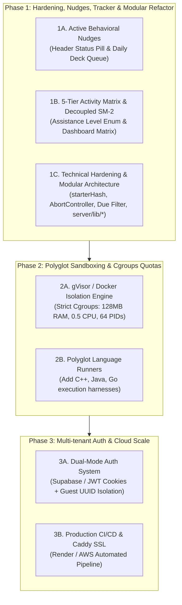

# 🎯 AlgoDeck — Master Architecture, Expansion Roadmap & Hardening Blueprint

This document serves as the **authoritative master plan** for **AlgoDeck**. It consolidates all past architectural modernization efforts, system audit findings, UX gap analyses, and refined multi-phase expansion specifications into a single reference document.

---

## 📅 System Architecture & Modernization Record

### 🏛️ The 4-Pillar Modernization Plan (Completed & Ground-Truth Verified)

| Pillar | Focus | Implementation Summary | Status |
| :--- | :--- | :--- | :---: |
| **Pillar A** | **Clean Starter Code (2–3 Lines)** | Implemented `extractPythonBoilerplate()` & `extractJsBoilerplate()` in `server/server.js`. Stripped docstrings, test blocks, and complexity hints while preserving helper classes (`ListNode`, `TreeNode`, `TrieNode`). Added leading blank line trimming so code starts directly on Line 1. | ✅ COMPLETED |
| **Pillar B** | **Backend Test Harness Injection** | Added `extractPythonTests()` & `extractJsTests()` in `server/server.js`. `POST /api/run` accepts `problem_path` and dynamically appends unit test assertions in memory at execution time. | ✅ COMPLETED |
| **Pillar C** | **Complexity Hint Isolation** | Removed complexity spoilers (`O(N)`, `O(1)`) from starter stubs; restricted hints to the unlocked Reference Solution view. | ✅ COMPLETED |
| **Pillar D** | **Description Typography Standardization** | Converted 23 plain PRE descriptions in `server/descriptions.json` to structured HTML cards (`example-block`, `<code>` pills, constraints). | ✅ COMPLETED |

*Audit Verification*: All 150 solution files (75 Python + 75 JS) extracted with **0 errors**, **0 leading blank lines**, and **100% test pass rate**.

---

## 🔍 Investigation: The "Due Filter" Gap & UX Findings

### ❓ Question: "Where even is the due filter? I don't see it anywhere."
- **Current System Behavior**:
  - The backend calculates `is_due` (`next_review <= now`) for every problem.
  - In `public/editor.html`, `is_due` is used to attach a small `[Due Today]` badge to problem cards in the sidebar.
  - Selecting **Sort by: "Next Review"** in the dropdown floats due items to the top of the sidebar.
- **The UX Gap**:
  - There is **no explicit button or checkbox** for `[ ] Due Today Only` in the filter UI!
  - Users are forced to manually sort by "Next Review" and scroll through the list rather than toggling a dedicated "Due Only" view.
- **Planned Solution**:
  - Add an explicit toggle button: `[ 🔔 Due Only (Count) ]` in both `editor.html` sidebar and `dashboard.html` filter bar.

---

## 🛡️ Phase 1 Summary: Hardening, Refactor & Consistency Checklist

Before expanding to Phase 2 (Polyglot Execution & Sandbox Cgroups) and Phase 3 (Multi-tenant Auth), the following stability, consistency, data-sync, and architectural refactoring items must be addressed in Phase 1:

### 1. UX & Branding Consistency
- **Issue**: Page titles lack brand identity (`<title>Home Page</title>`, `<title>Coding Playground</title>`). Users opening multiple browser tabs cannot distinguish AlgoDeck pages.
- **Fix**: Standardize all `<title>` tags to follow `AlgoDeck | <Page Name>`:
  - `index.html` → `<title>AlgoDeck | Home</title>`
  - `editor.html` → `<title>AlgoDeck | Coding Playground</title>`
  - `dashboard.html` → `<title>AlgoDeck | Problem Dashboard</title>`
  - `roadmap.html` → `<title>AlgoDeck | Curriculum Roadmap</title>`
  - `docs.html` → `<title>AlgoDeck | Technical Docs</title>`
- **Route Aliases**: Map clean Express routes in `server/server.js` (`/playground` → `editor.html`, `/editor` → `editor.html`, `/dashboard` → `dashboard.html`) to eliminate `404` errors when omitting `.html`.

### 2. Async State Management & Race Conditions
- **Issue A: In-Flight Fetch Cancellation**: Rapidly switching problems or languages triggers overlapping `/api/boilerplate` fetch promises. Out-of-order promise resolution can overwrite Monaco with stale code.
  - *Solution*: Attach an `AbortController` to cancel in-flight boilerplate requests on new problem selection.
- **Issue B: Stale Reference Solution Cache**: Clicking "Reveal Solution" on Problem B while Problem A's text is still present in `solutionEditor` prevents fetching Problem B's solution.
  - *Solution*: Execute `solutionEditor.setValue("")` immediately upon `selectProblem()`.

### 3. Data Sync & Draft Cache Versioning (`starterHash`)
- **Issue A: Spaced Repetition UI Sync**: Submitting a performance rating updates the DB/JSON file, but local `activeProblem` memory in `editor.html` is not mutated, causing the SR badge to show stale dates until page reload.
  - *Solution*: Instantly mutate local `activeProblem` fields (`next_review`, `interval`) upon `/api/submit` response.
- **Issue B: `starterHash` Draft Versioning**: Relying on client-side regex matching to purge stale drafts is brittle when starter code signatures are updated in `content/`.
  - *Solution*: Attach a 32-bit `starterHash` to `localStorage` entries (`{ starterHash: "a1b2c3", userCode: "..." }`). If `starterHash` mismatches the current server starter stub, display an un-intrusive notification offering to load the fresh stub or keep the local draft.
- **Issue C: Scratch Cleanup**: Node crashes during `/api/run` can leave orphan temporary files in `server/scratch/`.
  - *Solution*: Add a 3-line startup directory sweep in `server.js` to unlink `_temp_run_*` files older than 1 hour on server boot.

### 4. Modular Backend Refactoring
- **Issue**: `server/server.js` (~750 lines) combines Express routing, AST parsing, subprocess execution, path security validation, and static serving in a single file.
- **Fix**: Modularize `server/server.js` into focused, single-responsibility modules:
  - `server/lib/parser.js` — AST boilerplate & test harness extraction logic.
  - `server/lib/sandbox.js` — Subprocess execution runner & scratch file lifecycle.
  - `server/lib/security.js` — Path traversal shield & sliding-window rate limiter.

---

## 🚀 Refined Phase Expansion Roadmap (Phases 1, 2 & 3)

---

### Phase 1A: Active Behavioral Nudges & "Daily Deck Queue"

#### 1. Integrated Header Status Pill & 24h Snooze
- On page load (`dashboard.html` or `editor.html`), query due status (`is_due`).
- If `is_due` count > 0, render an un-intrusive status pill in the navbar header:
  > `🔔 3 Due Today [Start Session →]`
- Include a 24-hour "Snooze Review Notifications" toggle saved in `sessionStorage` to prevent notification fatigue while browsing docs or roadmap pages.

#### 2. Dedicated "Daily Deck" Review Mode (`/editor.html?mode=daily_deck`)
- Automatically loads due problems in sequence.
- After submitting a passing solution and rating quality (q = 0..5), auto-advances to the next due problem in the queue.
- Includes pre-session SM-2 confidence prompting (*"How confident are you with this pattern?"*).

#### 3. Decoupled Recall Math vs. Assistance Level Enum
- **Mathematical Decoupling**: Keep raw SuperMemo-2 quality scores (q = 0..5) unconstrained for interval calculations (I_n = I_{n-1} × EF), preserving natural exponential memory decay curves.
- **Assistance Metadata Tagging**: Store `assistance_level` (`CLEAN`, `HINT_USED`, `SOLUTION_REVEALED`) as an independent column in PostgreSQL/JSON storage.
- **Dashboard Representation**: Mark assisted runs as `🔓 Assisted Pass` without corrupting the underlying EF growth equations.

---

### Phase 1B: 5-Tier Problem Activity & Assistance Analytics Matrix

Add a dedicated **Problem Activity Matrix** inside `dashboard.html`:

#### 1. The 5-Tier Interaction Spectrum
1. ⚪ **Unseen**: Never opened or attempted.
2. 🟡 **Attempted**: Opened or code typed, but tests not yet passed.
3. 🟢 **Clean Pass**: 100% tests passed **without** revealing hints/solution (`assistance_level = CLEAN`).
4. 🔓 **Assisted Pass**: 100% tests passed, but Reference Solution or Hints were viewed (`assistance_level = HINT_USED | SOLUTION_REVEALED`).
5. 🌟 **Mastered**: 3+ consecutive successful reviews with SM-2 Quality q >= 4.

#### 2. Activity Matrix Table
Filterable, searchable table detailing:
- Problem Name & Category
- Interaction Status Badge
- Assistance Flag (`🛡️ Clean` vs `💡 Hint Used` vs `🔓 Solution Unlocked`)
- Total Submission Attempts & Fail Count
- Historical Quality Ratings (0–5 timeline)
- Last Attempt Date & Next Review Due Date

---

### Phase 2: Polyglot Sandboxing & Security Hardening
- **gVisor / Docker Cgroups Execution**:
  - Wrap `/api/run` in isolated ephemeral containers with strict resource controls: memory limit (`128MB`), CPU quota (`0.5 cores`), PID limit (`64`), and disabled networking (`--network none`).
- **Language Expansion**:
  - Add C++ (`g++`), Java (`openjdk`), and Go (`go run`) execution harnesses alongside Python and JavaScript.

---

### Phase 3: Multi-Tenant Cloud Architecture & Distribution
- **Dual-Mode Auth**:
  - Registered users authenticate via JWT cookies linked to PostgreSQL (`users` table).
  - Guest visitors receive isolated UUIDs stored in `localStorage` to prevent shared state contamination.
- **CI/CD & Automated Cloud Deployment**:
  - GitHub Actions workflow testing all 150 solutions and deploying to Render / AWS with Caddy auto-HTTPS.

---

## 📝 Refined Task & Solution Reference Matrix

| ID | Module | Issue / Feature | Refined Technical Solution | Targeted File(s) |
| :---: | :--- | :--- | :--- | :--- |
| **T-101** | UX/Nav | Missing explicit "Due Filter" button | Add `[ 🔔 Due Only ]` toggle button in sidebar & dashboard filter bars. | `public/editor.html` `public/dashboard.html` |
| **T-102** | UX/Nav | Generic document `<title>` tags | Update all HTML `<title>` tags with brand prefix `AlgoDeck \| <Page>`. | All `.html` files in `public/` |
| **T-103** | Server | No clean route aliases | Add `app.get('/playground')`, `/editor`, `/dashboard` route handlers. | `server/server.js` |
| **T-104** | Editor | Fetch race condition during rapid switch | Implement `AbortController` for `/api/boilerplate` fetch promises. | `public/editor.html` |
| **T-105** | Editor | Solution editor stale cache leak | Add `solutionEditor.setValue("")` to `selectProblem()`. | `public/editor.html` |
| **T-106** | SR Engine | Proactive behavioral nudges | Integrated navbar status pill `🔔 3 Due Today`, 24h snooze, & `daily_deck` queue mode. | `public/js/global.js` `public/editor.html` |
| **T-107** | Dashboard | Granular attempt & assistance tracking | 5-Tier Activity Matrix with decoupled `assistance_level` enum (`CLEAN`, `HINT_USED`, `SOLUTION_REVEALED`). | `public/dashboard.html` `server/server.js` `server/db.js` |
| **T-108** | Sandbox | Orphan scratch file accumulation | Add startup cleanup sweep for `server/scratch/_temp_run_*` files older than 1h. | `server/server.js` |
| **T-109** | Draft Cache | Brittle regex draft purging | Attach 32-bit `starterHash` to `localStorage` keys for clean stub synchronization. | `public/editor.html` `server/server.js` |
| **T-110** | Backend Arch| Monolithic `server.js` structure | Modularize `server.js` into `server/lib/parser.js`, `sandbox.js`, and `security.js`. | `server/server.js` `server/lib/*` |
