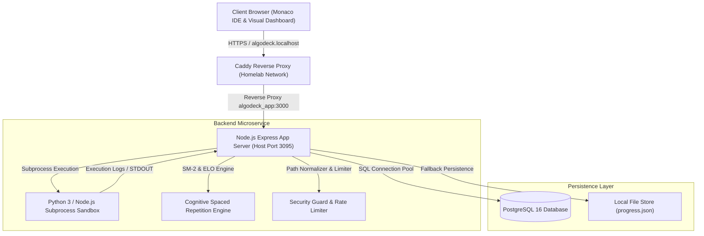

# 🏛️ AlgoDeck System Architecture

> **AlgoDeck** is a full-stack, local-first Data Structures & Algorithms (DSA) learning platform and adaptive practice engine. It combines real-time code execution, spaced-repetition cognitive algorithms, interactive Monaco IDE workspaces, and homelab container microservices.

---

## 📐 1. High-Level Architecture Diagram



---

## 🏛️ 2. Key Architectural Pillars

### 1. 🧠 Cognitive Spaced Repetition & ELO Engine
- **SuperMemo-2 (SM-2) Spaced Repetition**: Calculates optimal review intervals based on user performance scores ($q \in [0..5]$):
  - **Repetitions ($n$)**: Number of consecutive successful reviews.
  - **Interval ($I$)**: Days until next scheduled review ($I_1 = 1$, $I_2 = 6$, $I_n = I_{n-1} \times EF$).
  - **Ease Factor ($EF$)**: Updated via $EF' = EF + (0.1 - (5 - q) \times (0.08 + (5 - q) \times 0.02))$.
- **ELO Rating System**: Dynamically adjusts user rating ($R_{user}$) and problem difficulty rating ($R_{prob}$) using the logistic expected probability function:
  $$E_A = \frac{1}{1 + 10^{(R_{prob} - R_{user}) / 400}}$$
  $$R'_{user} = R_{user} + K \times (S - E_A)$$

### 2. ⚡ Secure Subprocess Code Execution Sandbox
- **Subprocess Isolation**: Untrusted user code is executed in isolated child processes using Node.js `child_process.execFile`.
- **Resource Constraints**:
  - **Timeout Limit**: 5.0 seconds hard ceiling. Exceeding processes are killed (`SIGKILL`) with an `Execution Timeout` response.
  - **Buffer Limit**: 512KB maximum STDOUT/STDERR output buffer.
  - **Environment Sanitization**: Cleaned environment variables with unique temp file lifecycle management (`_temp_run_<timestamp>_<rand>`).

### 3. 💻 LeetCode-Standard Monaco IDE Workspace
- **VS Code Monaco Editor Integration**: Embedded web editor configured with custom syntax highlighting, bracket pair colorization, smooth carets, and indentation guides.
- **AST Boilerplate Extraction**: Strips test assertions and main runner blocks from solution files to auto-generate clean starter code (`extractPythonBoilerplate`, `extractJsBoilerplate`).
- **Interactive Action Tools**: Font size scaling ($11px \rightarrow 24px$) with `localStorage` persistence, document auto-formatting, word wrap toggling, and starter code reset.

### 4. 🗄️ Hybrid Dual-Mode Persistence Layer
- **Production Relational Database**: PostgreSQL 16 database using `pg` Connection Pool with automatic table creation and migrations.
- **Development Fallback**: Zero-dependency local JSON file store (`progress.json`) activated when PostgreSQL is offline.

### 5. 🔒 Security & Protection Layer
- **Path Traversal Shield**: Strictly normalizes and validates content paths (`safeResolveContentPath()`) to prevent directory escape attempts (`../package.json`, `/etc/passwd`).
- **Rate Limiter**: Custom sliding window rate-limiting middleware to prevent execution denial-of-service.
- **CORS Protection**: Restricted HTTP header origins.

### 6. 🐳 DevOps & Microservice Infrastructure
- **Containerization**: Multi-container Docker deployment (`algodeck_app` Node.js 20 Alpine + `algodeck_db` PostgreSQL 16).
- **Homelab Caddy Integration**: Connected to external `homelab` Docker bridge network, exposed via reverse proxy at `https://algodeck.localhost`.
- **Bookmark Bar Cache Headers**: Configured long-term caching (`Cache-Control: public, max-age=86400`) for favicon assets (`favicon.ico`, `favicon.svg`, `favicon-32x32.png`).

---

## 📊 3. Database Schema

```sql
CREATE TABLE IF NOT EXISTS user_progress (
    user_id VARCHAR(50) PRIMARY KEY,
    user_rating INT DEFAULT 1200,
    created_at TIMESTAMP DEFAULT CURRENT_TIMESTAMP,
    updated_at TIMESTAMP DEFAULT CURRENT_TIMESTAMP
);

CREATE TABLE IF NOT EXISTS problem_progress (
    user_id VARCHAR(50),
    problem_id VARCHAR(50),
    interval INT DEFAULT 0,
    ease_factor REAL DEFAULT 2.5,
    repetitions INT DEFAULT 0,
    next_review BIGINT DEFAULT 0,
    updated_at TIMESTAMP DEFAULT CURRENT_TIMESTAMP,
    PRIMARY KEY (user_id, problem_id)
);
```

---

## 🧪 4. Automated Test Harness

The system includes a 3-tier automated test suite executed via `npm test` or `python3 tests/run_all_tests.py`:

1. **`tests/content_tests.py`**: Audits all 75 problems for complete HTML descriptions, solution file paths, and valid boilerplate extraction.
2. **`tests/security_tests.py`**: Penetration tests for path traversal, 5s timeouts, and rate limiting.
3. **`content/test_runner.py`**: Evaluates all 150 Python & JS solution files against assertion test cases.
